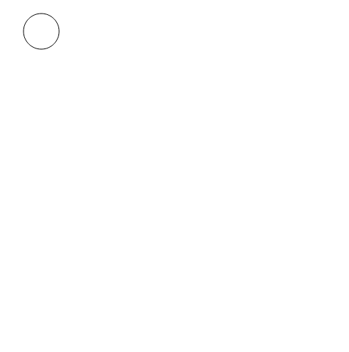

# Link to the documentation

https://github.com/MAKIO135/svg5.js#documentation

# default code

```js
// Create a 500 x 500 pixels drawing space
// just change the numbers to change the size
createSVG(500, 500);

//
// put your code here
//

render();
```

# How to draw a simple shape

You can quickly use the functions for primitive shapes shown here : https://github.com/MAKIO135/svg5.js#shapes


```js
circle(62, 47, 50);
```


## with a different color
```js
// you can use the CSS names of the colors
//https://www.w3schools.com/cssref/css_colors.php
fill("turquoise");
circle(62, 47, 50);

// you can also specify an hexadecimal coded color
fill("#191977");
circle(132,47, 40);

// or you can specify 3 numbers in between 0 and 255
// first one is the red, then green, then blue (RGB)
fill(150, 0, 150);
circle(192,47, 30);
```


## with a different border (this also affects the lines)
To change the colors of the borders and the lines it's exactly the same as with the fill, except you need to use the `stroke()` function
```js
stroke(255,0,0);
circle(63, 47, 50);
```

# How to draw many things at once

```js
//do the thing for i starting at 0
//so long as i is below 5
//also, add 1 to i each time
for (let i = 0; i < 5; i = i + 1) {
  ellipse(20 + i * 10, 400, 50, 100);
  // so, first time i = 0,
  // then i = 1
  // then i = 2
  // then i = 3
  // then finaly i = 4
}
```


# How to _maybe_ draw something

```js
// first we generate a number between 0 and 100 and then call it "chance"
const chance = random(0,100);

// if the chance is below 75, then we do what's inside
if (chance < 75) {
  circle(12, 47, 50);
}
```

# How to draw something differently each time
TODO 

# Custom shapes
https://github.com/MAKIO135/svg5.js#vertex-shapes

## "Open"

```js
beginShape();
vertex(30, 20);
vertex(85, 20);
vertex(85, 75);
vertex(30, 75);
endShape();
```


## "Closed"

```js
beginShape();
vertex(30, 20);
vertex(85, 20);
vertex(85, 75);
vertex(30, 75);
endShape(CLOSE);
```


# Try to reproduce these
## Exercise 1


<details><summary>Answer</summary>
<pre><code>
createSVG(500, 500);
fill("#F27B2C");
rect(30, 30, 50, 50);

fill("#009DA6");
circle(150, 150, 50);

line(0, 0, 500, 500);

render();
</code></pre>

</details>

## Exercise 2


<details><summary>Answer</summary>
<pre><code>
createSVG(500, 500);  

fill("rebeccaPurple")
beginShape();
vertex(30, 25);
vertex(85, 25);
vertex(100, 50);
vertex(85, 75);
vertex(30, 75);
vertex(15, 50);
endShape(CLOSE);

render();
</code></pre>

you can also use the <code>polygon()</code> function
<pre><code>
createSVG(500, 500);

fill("rebeccaPurple")
polygon(30, 25,85, 25,100, 50,85, 75,30, 75,15, 50);

render();
</pre></code>
</details>

## Exercise 3
<details><summary>Hint</summary>
All you need are the <code>line()</code> and <code>stroke()</code> functions and a <code>for</code> loop
</details>


<details><summary>Answer</summary>
<pre><code>
createSVG(500, 500);  

for (i = 0; i < 255; i++) {
    stroke(0, 255, 255 - i);
    line(120 + i, 200, 120 + i, 300);
}

render();
</code></pre>

</details>
